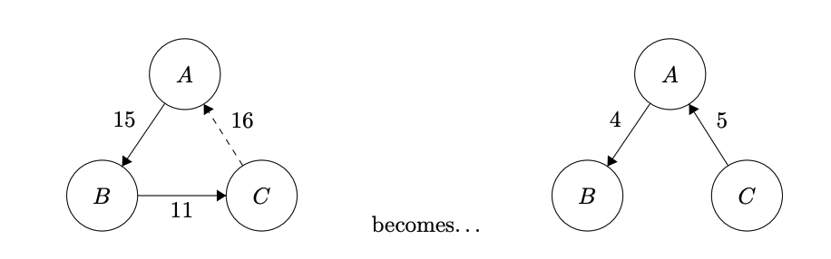

## Blockchain Splitwise
A decentralized system to track debit and credit - a blockchain version of Splitwise

It’s a simple way to keep track of who owes who money within a group of people (maybe after splitting lunch, groceries, or bills)

### How to run
1. Install Ganache CLI `n npm install -g ganache-cli`
2. run `ganache-cli` to run the node
3. Run remix, and deploy the contract
4. Paste the contract address in `script.js`
5. Run `index.html` in browser and enjoy

### Design Principles
#### Resolve loops of debt

